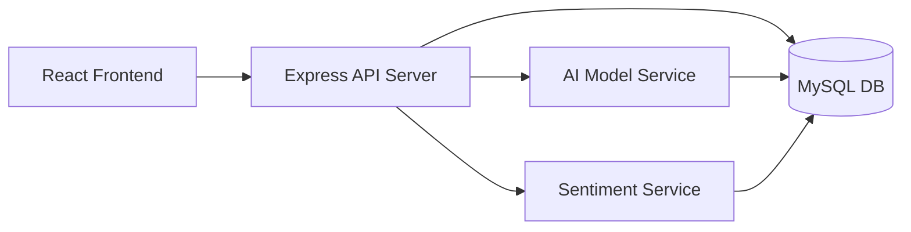

# Smart Event Backend

Node.js + Express backend for the Smart Event Management System.

Provides APIs for event creation, AI prediction (attendance + venue), feedback sentiment analysis, and core event-management modules.

## Repository

GitHub: https://github.com/krishnapriyavr3/Event-Mini-Project

## Tech Stack

- Node.js
- Express
- MySQL (mysql2)
- dotenv
- CORS

## Project Structure

backend/
- server.js
- db.js
- src/
  - aiModelService.js
  - sentimentService.js

## Prerequisites

- Node.js 18+
- npm 9+
- MySQL 8+

## Environment Variables

Create `.env` inside `backend/`:

DB_HOST=localhost
DB_USER=root
DB_PASSWORD=your_password
DB_NAME=college_event_db
PORT=5000

## Run Backend

cd backend
npm install
npm run start

Server default URL:

http://localhost:5000

Useful scripts:

- npm run dev
- npm run start
- npm run start:clean
- npm run seed:demo

## Architecture

## AI Modules

### 1) Attendance + Venue Prediction (`src/aiModelService.js`)

Training data source (MySQL):
- `events` table:
  - `event_name`
  - `type`
  - `expected_attendance` (if available)
  - `budget` (fallback signal)
  - `venue_id`
  - `description` (if available)
- `venues` table:
  - `venue_id`, `venue_name`, `location`, `capacity`, `type`

Inference input:
- `name`
- `type`
- `description`
- `budget`

Output:
- `predictedAttendance`
- `confidence`
- `recommendedVenue`
- lightweight model metadata

### 2) Feedback Sentiment Analysis (`src/sentimentService.js`)

Uses lexicon-based scoring with negation handling.

Input:
- feedback `comments`

Output:
- `label` (`Positive`, `Neutral`, `Negative`)
- `score` (0-100)
- keyword cues (`positiveHits`, `negativeHits`)

## API Endpoints

Base URL: `http://localhost:5000/api`

### Health / Stats

#### GET `/stats`
Returns dashboard stats.

#### GET `/model-health`
Returns high-level model readiness info.

Response (example):
{
  "totalEvents": 34,
  "upcoming": 19,
  "totalStudents": 40
}

---

### Events

#### POST `/events`
Create a new event.

Request body:
{
  "name": "AI Campus Workshop",
  "type": "Technical",
  "date": "2026-03-15",
  "location": "IT Block Seminar Hall",
  "description": "Hands-on ML workshop with coding challenge",
  "budget": 12000
}

Response:
{
  "message": "Event Created",
  "event_id": "E734"
}

---

### AI Prediction

#### POST `/ai/predict-event`
Predict attendance and recommend venue.

Request body:
{
  "name": "Tech Symposium",
  "type": "Technical",
  "description": "AI machine learning coding challenge",
  "budget": 15000
}

Response (example):
{
  "predictedAttendance": 214,
  "confidence": 98,
  "recommendedVenue": {
    "venue_id": "V019",
    "venue_name": "MBA Seminar Hall",
    "location": "MBA Block",
    "capacity": 220,
    "type": "Hall"
  },
  "model": {
    "trainedOnEvents": 39,
    "signalsUsed": 7
  }
}

#### GET `/attendance-prediction/:eventName`
Legacy attendance-only prediction.

Response:
{
  "predictedAttendance": 188
}

---

### Feedback + Sentiment

#### POST `/feedback`
Save feedback and return sentiment analysis.

Request body:
{
  "event_id": "E001",
  "student_id": "U001",
  "rating": 5,
  "comments": "The workshop was excellent, engaging and informative"
}

Response (example):
{
  "success": true,
  "message": "Feedback submitted successfully",
  "sentiment": {
    "label": "Positive",
    "score": 100,
    "positiveHits": ["excellent", "engaging", "informative"],
    "negativeHits": []
  }
}

#### GET `/feedback/trends/:eventId`
Returns sentiment distribution and average rating for trend visualization.

Response (example):
{
  "positive": 8,
  "neutral": 2,
  "negative": 1,
  "total": 11,
  "averageRating": 4.18
}

---

### Participants

#### GET `/participants`
Fetch student participants.

#### POST `/participants/invite`
Simulate invitation sending.

---

### Volunteers

#### GET `/volunteers`
Get volunteer list.

#### GET `/volunteers/assignments/:eventId`
Get assignments for an event.

#### POST `/volunteers/assign`
Assign volunteer to an event.

---

### Resources

#### GET `/resources`
Get resources.

#### POST `/resources/request/:id`
Request/decrement a resource.

## Notes

- Backend handles schema differences for feedback table columns where possible.
- If port 5000 is busy, stop old process and restart backend.
- Frontend expects API base at `http://localhost:5000/api`.
